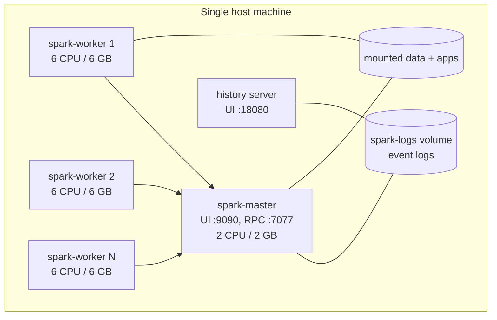

# Apache Spark on Docker: local cluster setup and benchmarking

Tooling for building a multi-node **Apache Spark** cluster on a single machine with Docker Compose (or Vagrant), and a benchmarking harness to measure how Spark behaves under different resource configurations.

This is the code behind the conference paper:

> A. P. Ndigande, I. Ari, S. Özer, **"Analysis and Comparison of Dockerized and Standalone Apache Spark Configurations for Efficient Distributed Data Processing"**, *2024 Innovations in Intelligent Systems and Applications Conference (ASYU)*, IEEE. [PDF](https://possenalain.github.io/files/Apache_Spark_Benchmarking_on_Local_Cluster_with_Docker.pdf)

## Why it exists

Containerised Spark is convenient, but what does it cost? The paper benchmarks Spark WordCount on Wikipedia text (1 GB to 25 GB) while varying the number of executors, cores and memory per executor, and the number of worker nodes, comparing a Docker-based cluster with a standalone (no Docker) setup on the same machine. This repository is the reproducible environment and the scripts used for that comparison.

**Headline findings from the paper** (see the PDF for the full analysis and the exact figures):

- As dataset size grew, the standalone setup ran roughly **2x faster** than the Dockerised one on the same hardware.
- Running Spark in Docker locally adds parameter complexity as well as performance overhead.
- Going from 1 to 3 workers on a single machine cost roughly **10%** in run time, attributed to communication overhead.
- I/O bandwidth appeared to be a limiting factor in the larger runs.

## What is in the repository

| Path | Purpose |
|---|---|
| `docker-compose.yml`, `Dockerfile`, `entrypoint.sh` | Spark 3.5 standalone cluster: one master, N workers, and a history server, built on `python:3.10`. |
| `Makefile` | Shortcuts to build, start, scale, submit jobs to, and tear down the cluster. |
| `config/spark-defaults.conf` | Master URL and event-log settings shared by all nodes. |
| `benchmarks/` | The WordCount benchmark harness and the notebooks used for the experiments (see below). |
| `examples/` | Introductory PySpark notebooks: RDDs, SparkSession, Spark SQL, word count. |
| `scripts/` | Helpers to gzip/gunzip datasets (used for the compression experiment). |
| `alternatives/spark-vagrant-cluster/` | The same idea with four VirtualBox VMs provisioned by Vagrant. |

## Architecture



Workers are stateless and scale with `docker-compose up --scale spark-worker=N`. Every container mounts the same event-log volume, so finished jobs show up in the history server.

## Quick start (Docker)

Prerequisites: Docker and Docker Compose. The Compose file expects two things that are not stored in the repository, so create them once:

```bash
echo "SPARK_NO_DAEMONIZE=true" > .env.spark   # keeps the Spark daemons in the foreground of each container
mkdir -p book_data spark_apps                  # datasets and Spark applications mounted into the containers
```

Then:

```bash
make build            # build the image
make run-scaled       # start master + 3 workers + history server (detached)
# Spark master UI:   http://localhost:9090
# History server UI: http://localhost:18080

cp examples/example.py spark_apps/
make submit app=example.py   # spark-submit against spark://spark-master:7077

make down             # stop and remove containers and volumes
```

`make run` starts the cluster in the foreground with a single worker, and `make run-d` starts it detached.

## Benchmarking

`benchmarks/benchmarking-wc-new.py` is a script (notebook-style, cell-delimited) that:

1. defines a WordCount job with lower-casing, punctuation stripping and stop-word removal;
2. builds a grid of executor configurations (memory, cores, number of instances);
3. **filters the grid against the cluster's actual resource budget** (total memory, total cores, per-worker limits), so only configurations that can really be scheduled are run;
4. runs each surviving configuration on datasets of increasing size and records the wall-clock time.

`benchmarks/02-bencmarking-wc.ipynb` and `benchmarks/using-compression.ipynb` are the notebooks used to run the standalone comparison and the effect of reading gzip-compressed input. The Wikipedia dumps themselves are not included in this repository (`data/` only holds links to where they were stored).

## Alternative: Vagrant cluster

`alternatives/spark-vagrant-cluster/` provisions a four-VM cluster with Vagrant and VirtualBox: a master, two workers and a client/driver node on a private network. See its README for usage.

## Citation

```bibtex
@inproceedings{ndigande2024spark,
  title     = {Analysis and Comparison of Dockerized and Standalone Apache Spark Configurations for Efficient Distributed Data Processing},
  author    = {Ndigande, Alain P. and Ari, Ismail and {\"O}zer, Sedat},
  booktitle = {2024 Innovations in Intelligent Systems and Applications Conference (ASYU)},
  year      = {2024},
  publisher = {IEEE}
}
```

## Tech

Apache Spark 3.5, PySpark, Python 3.10, Docker, Docker Compose, Vagrant, Make, Jupyter.
